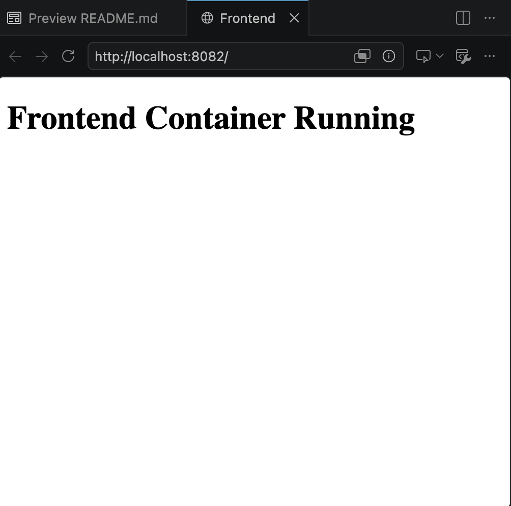
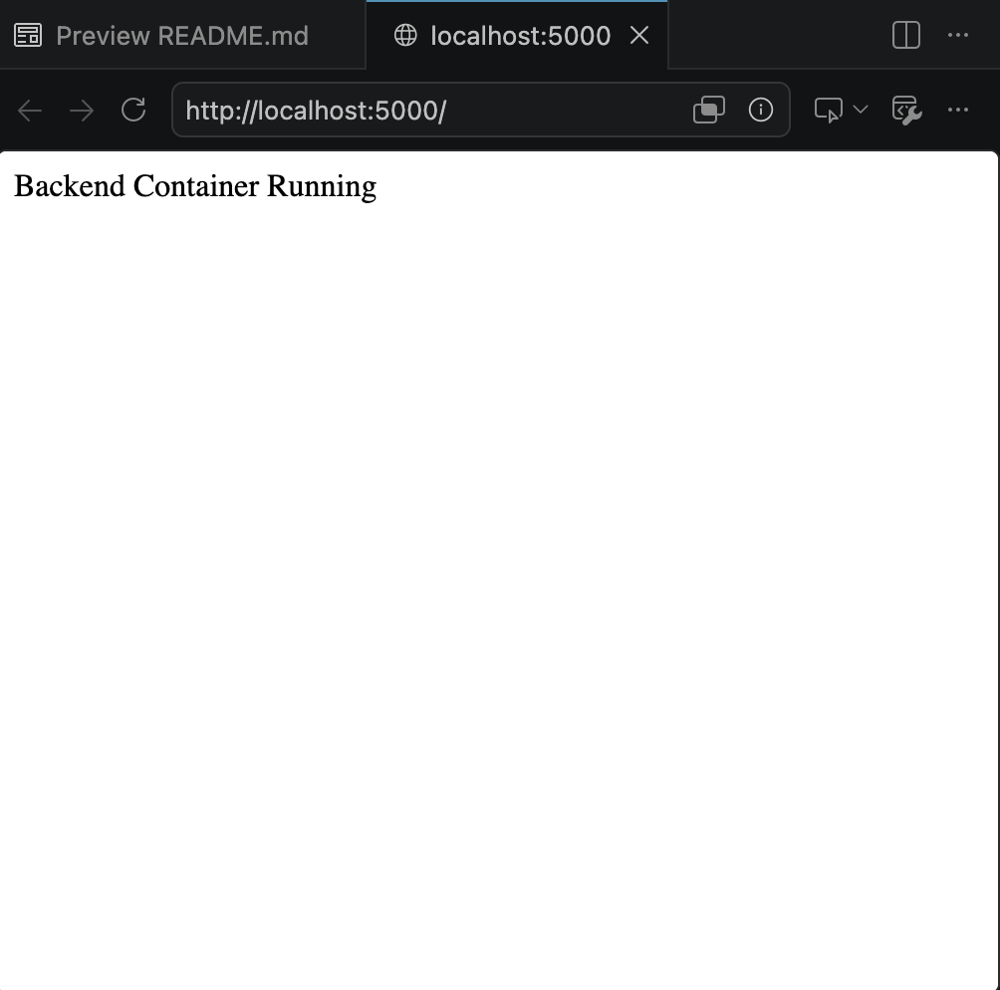
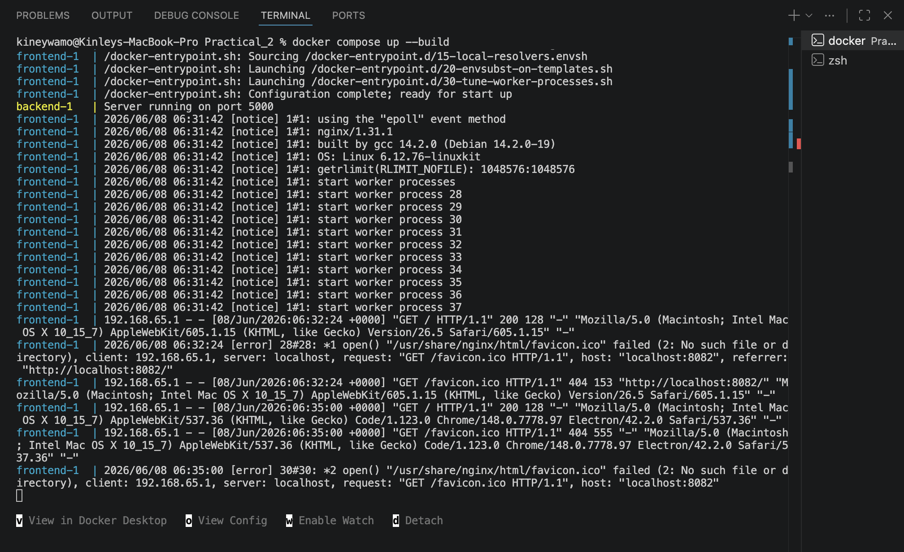
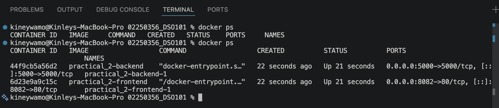

# Practical 2: Create a Multi-Container Application Using Docker Compose

## Objective

The objective of this practical is to learn how to use Docker Compose to manage and run multiple containers simultaneously. A frontend service and a backend service are containerized and deployed using a single Docker Compose configuration file.

---

## Prerequisites

* Docker Desktop installed
* Visual Studio Code
* Basic understanding of Docker containers

---

## Project Structure

```text
Practical_2
│
├── frontend
│   ├── index.html
│   └── Dockerfile
│
├── backend
│   ├── server.js
│   ├── package.json
│   └── Dockerfile
│
└── docker-compose.yml
```

---

## Frontend Service

### index.html

```html
<!DOCTYPE html>
<html>
<head>
    <title>Frontend</title>
</head>
<body>
    <h1>Frontend Container Running</h1>
</body>
</html>
```

### Dockerfile

```dockerfile
FROM nginx:latest

COPY index.html /usr/share/nginx/html/index.html

EXPOSE 80
```

---

## Backend Service

### server.js

```javascript
const express = require('express');

const app = express();

app.get('/', (req, res) => {
    res.send('Backend Container Running');
});

app.listen(5000, () => {
    console.log('Server running on port 5000');
});
```

### package.json

```json
{
  "name": "backend",
  "version": "1.0.0",
  "main": "server.js",
  "dependencies": {
    "express": "^4.18.2"
  }
}
```

### Dockerfile

```dockerfile
FROM node:18

WORKDIR /app

COPY package.json .

RUN npm install

COPY . .

EXPOSE 5000

CMD ["node", "server.js"]
```

---

## Docker Compose Configuration

### docker-compose.yml

```yaml
version: '3'

services:

  frontend:
    build: ./frontend
    ports:
      - "8082:80"

  backend:
    build: ./backend
    ports:
      - "5000:5000"
```

---

## Steps Performed

### Build and Run Containers

```bash
docker compose up --build
```

### Verify Running Containers

```bash
docker ps
```

### Stop Containers

```bash
docker compose down
```

---

## Testing

### Frontend

Open:

http://localhost:8082

Expected Output:

```text
Frontend Container Running
```
Frontend running


### Backend

Open:

http://localhost:5000

Expected Output:

```text
Backend Container Running
```

Backend running


---

## Commands Used

```bash
docker compose up --build
docker ps
docker compose down
```
## Screenshots
Docker Build


Docker container running


---

## Outcome

The frontend and backend services were successfully containerized and deployed using Docker Compose. Multiple containers were managed through a single configuration file, demonstrating the use of Docker Compose in multi-container application deployment.

---

## Conclusion

Docker Compose simplifies the deployment and management of multi-container applications. It enables developers to define services, networks, and dependencies in a single YAML file, making application deployment more efficient and reproducible.
