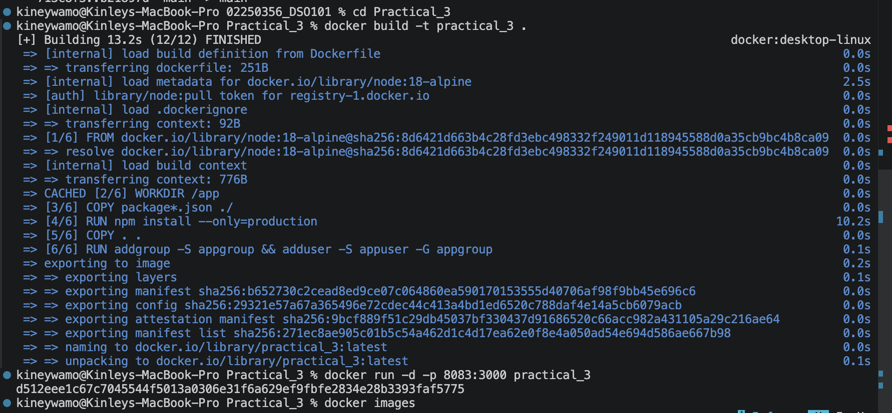
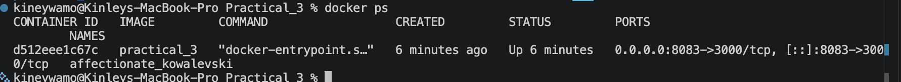
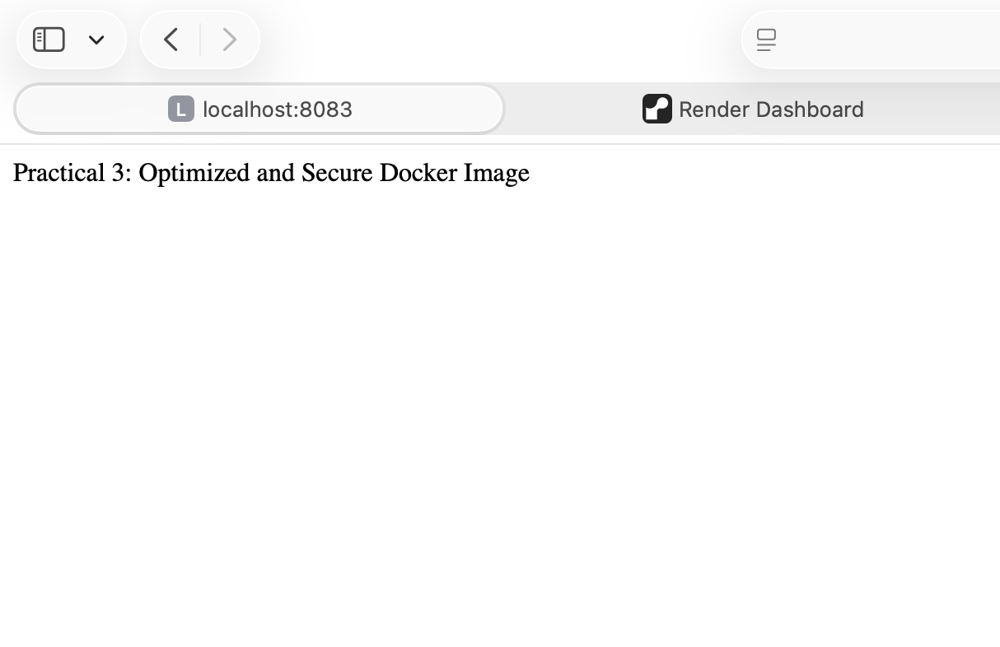
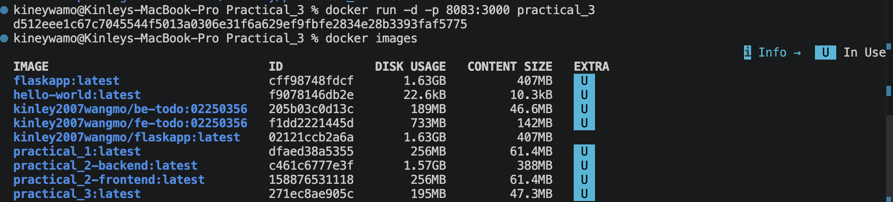

# Practical 3: Optimize Docker Images and Implement Security Best Practices

## Objective

The objective of this practical is to optimize Docker images and implement basic Docker security best practices. The practical demonstrates the use of lightweight base images, exclusion of unnecessary files, and execution of containers using a non-root user.

---

## Prerequisites

* Docker Desktop installed
* Visual Studio Code
* Basic knowledge of Docker

---

## Project Structure

```text
Practical_3
│
├── app.js
├── package.json
├── Dockerfile
└── .dockerignore
```

---

## Application Code

### app.js

```javascript
const express = require('express');

const app = express();

app.get('/', (req, res) => {
    res.send('Practical 3: Optimized and Secure Docker Image');
});

app.listen(3000, () => {
    console.log('Server running on port 3000');
});
```

---

### package.json

```json
{
  "name": "practical3",
  "version": "1.0.0",
  "main": "app.js",
  "dependencies": {
    "express": "^4.18.2"
  }
}
```

---

## Docker Ignore File

### .dockerignore

```text
node_modules
npm-debug.log
.git
.gitignore
README.md
```

### Purpose

The `.dockerignore` file prevents unnecessary files and folders from being copied into the Docker image, reducing image size and improving build performance.

---

## Dockerfile

```dockerfile
FROM node:18-alpine

WORKDIR /app

COPY package*.json ./

RUN npm install --only=production

COPY . .

RUN addgroup -S appgroup && adduser -S appuser -G appgroup

USER appuser

EXPOSE 3000

CMD ["node", "app.js"]
```

---

## Security Best Practices Implemented

### 1. Lightweight Base Image

```dockerfile
FROM node:18-alpine
```

The Alpine image is significantly smaller than the standard Node.js image and reduces the attack surface.

### 2. Excluding Unnecessary Files

The `.dockerignore` file prevents unwanted files from being copied into the image.

### 3. Non-Root User Execution

```dockerfile
USER appuser
```

Running containers as a non-root user improves security and minimizes potential damage if the container is compromised.

---

## Build Docker Image

```bash
docker build -t practical_3 .
```

---

## Run Docker Container

```bash
docker run -d -p 8083:3000 practical_3
```


---

## Verify Running Container

```bash
docker ps
```

---

## Access the Application

Open the browser and navigate to:

http://localhost:8083

Expected Output:

```text
Practical 3: Optimized and Secure Docker Image
```


---

## Commands Used

```bash
docker build -t practical3 .
docker run -d -p 8083:3000 practical3
docker ps
docker images
```


---

## Outcome

A lightweight and secure Docker image was successfully created and deployed. Image optimization techniques and Docker security best practices were implemented to improve efficiency and security.

---

## Conclusion

Docker image optimization reduces image size and improves deployment speed. Security best practices such as using Alpine images, excluding unnecessary files, and avoiding root users help create safer and more efficient containerized applications.
