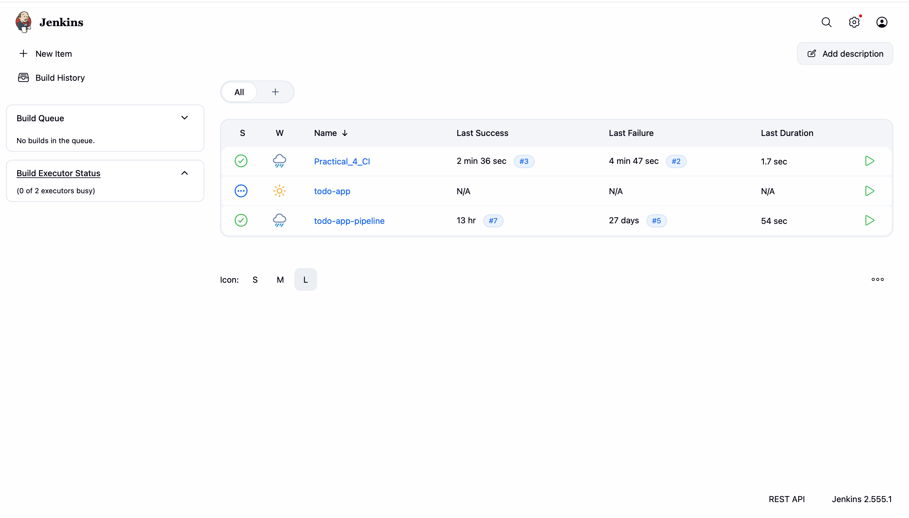
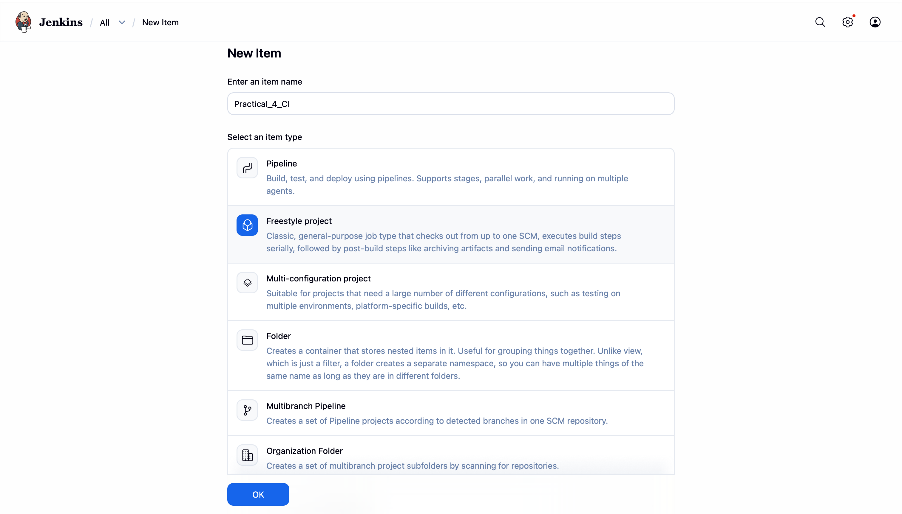
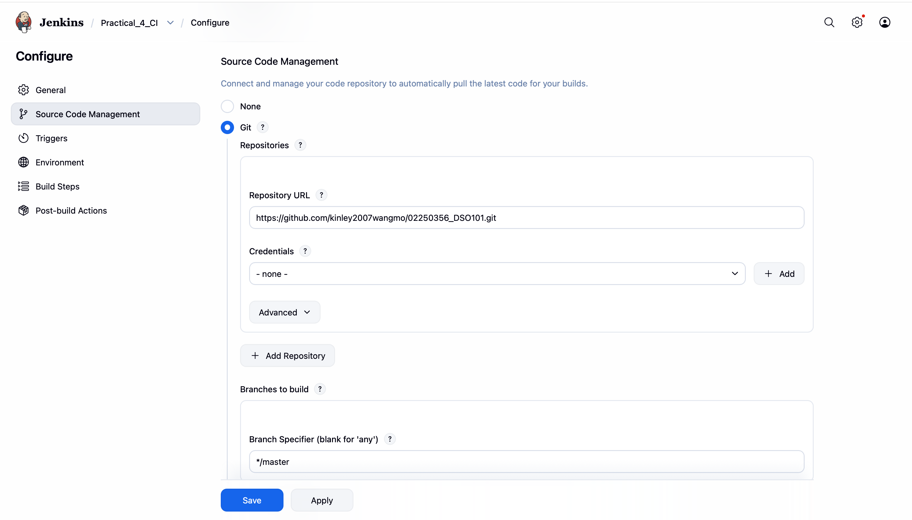
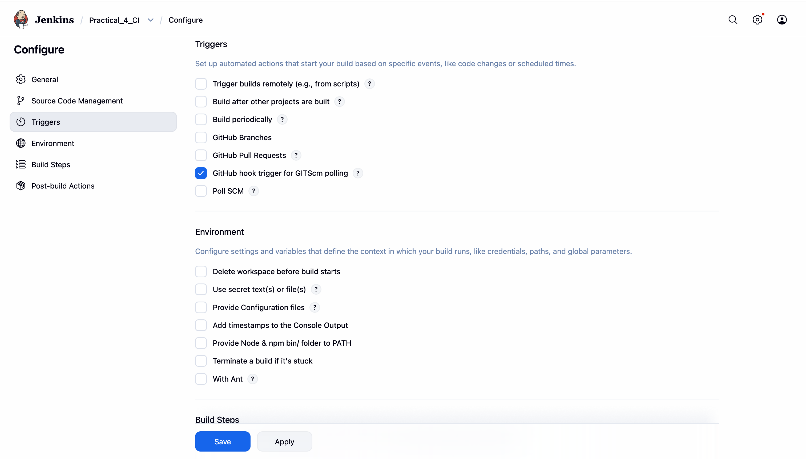
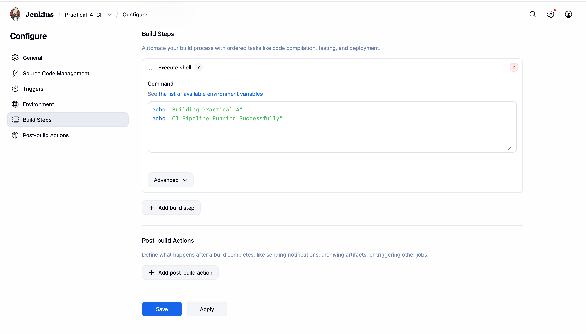
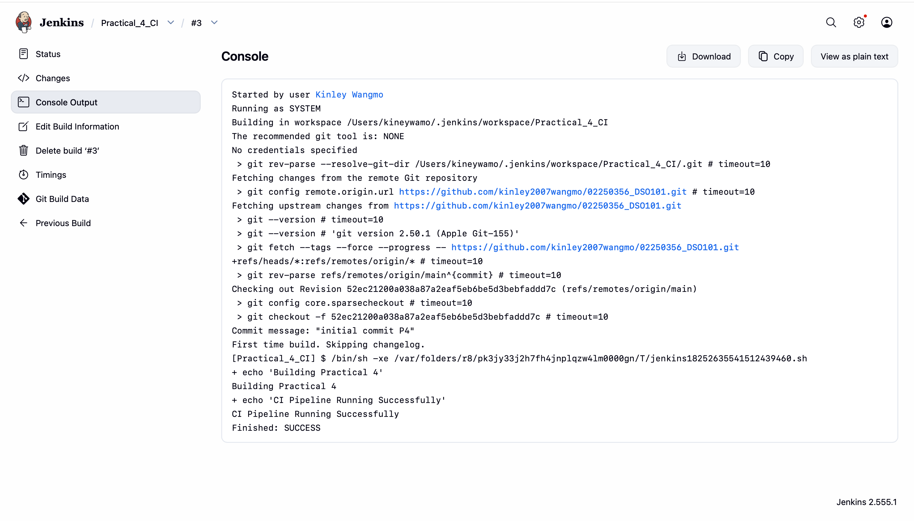
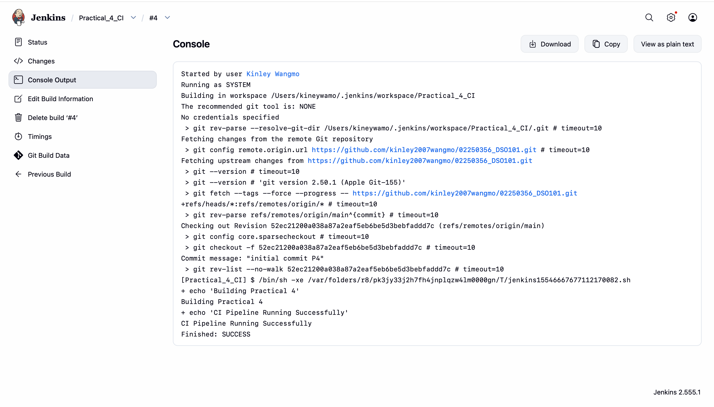

# Practical 4: Install and Configure Jenkins for Continuous Integration

## Objective

The objective of this practical is to install and configure Jenkins for Continuous Integration (CI). Jenkins is connected to a GitHub repository and configured to automatically build projects whenever code changes occur.

---

## Tools Used

* Jenkins
* Git
* GitHub
* Visual Studio Code

---

## Steps Performed

### 1. Verify Jenkins Installation

Jenkins was accessed through:

http://localhost:8080

The Jenkins dashboard confirmed successful installation.



### 2. Create a Freestyle Project

A Jenkins Freestyle Project named `Practical_4_CI` was created.


### 3. Configure Git Repository

The GitHub repository URL was added under Source Code Management.



### 4. Configure Build Trigger

GitHub hook trigger and SCM polling were configured to automatically detect repository changes.



### 5. Add Build Step

A shell command was added:

```bash
echo "Building Practical 4"
echo "CI Pipeline Running Successfully"
```



### 6. Execute Build

The project was built successfully using Jenkins.



### 7. Test Continuous Integration

Changes were pushed to GitHub and Jenkins automatically detected the changes and triggered a new build.



---

## Build Output

```text
Building Practical 4
CI Pipeline Running Successfully
Finished: SUCCESS
```

---

## Outcome

Jenkins was successfully configured for Continuous Integration. The Jenkins job automatically built the project whenever changes were pushed to GitHub.

---

## Conclusion

Continuous Integration improves software development by automating builds and reducing manual effort. Jenkins provides a reliable platform for automating the build process and integrating code changes efficiently.
