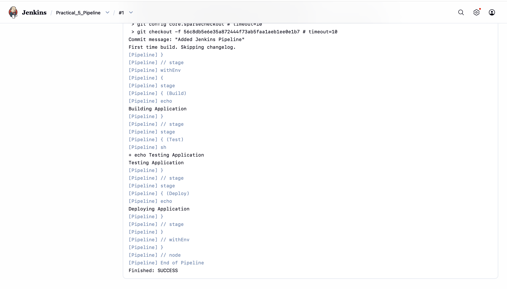

# Practical 5: Build, Test, and Deploy Using Jenkins Declarative Pipeline

## Objective

The objective of this practical is to implement a Jenkins Declarative Pipeline that automates the build, test, and deployment stages of an application.

---

## Project Structure

```text
Practical_5
│
├── app.js
├── package.json
├── Jenkinsfile
└── README.md
```

---

## Application Code

### app.js

```javascript
console.log("Application Running Successfully");
```

### package.json

```json
{
  "name": "practical5",
  "version": "1.0.0",
  "scripts": {
    "test": "echo Testing Application",
    "start": "node app.js"
  }
}
```

---

## Jenkinsfile

```groovy
pipeline {
    agent any

    stages {

        stage('Build') {
            steps {
                echo 'Building Application'
            }
        }

        stage('Test') {
            steps {
                sh 'echo Testing Application'
            }
        }

        stage('Deploy') {
            steps {
                echo 'Deploying Application'
            }
        }
    }
}
```

---

## Steps Performed

1. Created a simple Node.js application.
2. Added a Jenkinsfile containing Build, Test, and Deploy stages.
3. Pushed the project to GitHub.
4. Created a Jenkins Pipeline job.
5. Configured Jenkins to use Pipeline Script from SCM.
6. Executed the pipeline successfully.

---

## Pipeline Stages

### Build Stage

Builds the application.

### Test Stage

Runs application tests.

### Deploy Stage

Simulates application deployment.

---

## Expected Output

```text
Building Application
Testing Application
Deploying Application
Finished: SUCCESS
```



---

## Outcome

The Jenkins Declarative Pipeline successfully automated the build, test, and deployment process.

---

## Conclusion

Jenkins Pipelines provide a powerful way to automate software delivery workflows using Pipeline as Code principles.
