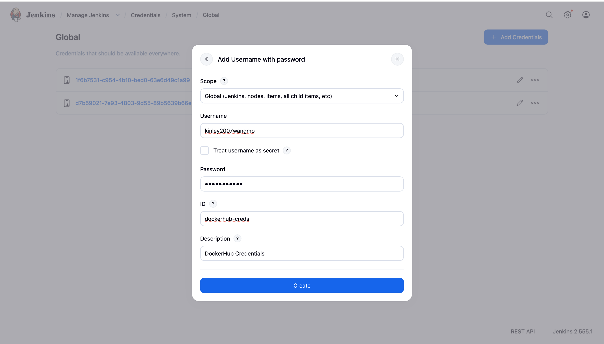
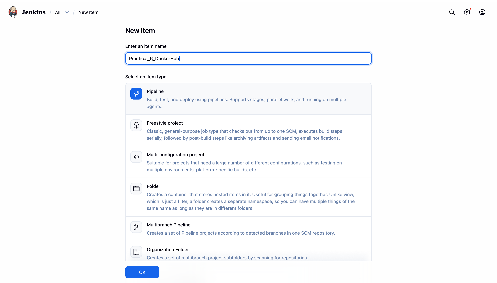
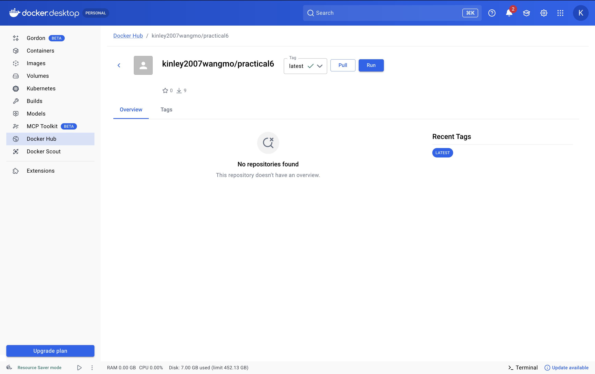
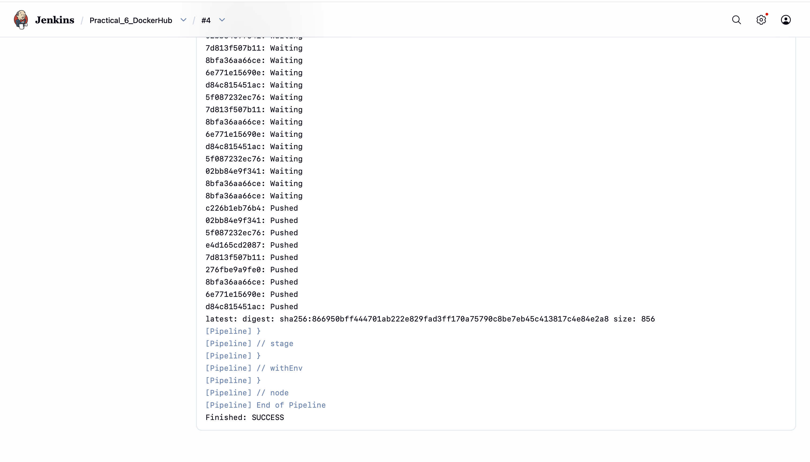
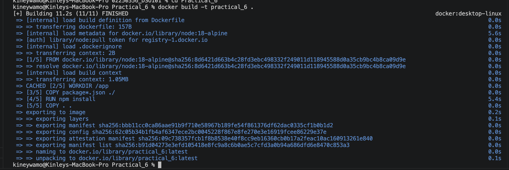

# Practical 6: Integrate DockerHub with Jenkins

## Objective

The objective of this practical is to integrate Jenkins with Docker Hub to automate the process of building and pushing Docker images. The Jenkins pipeline clones the source code from GitHub, builds a Docker image, logs in to Docker Hub securely using stored credentials, and pushes the image to the Docker Hub repository.

---

## Prerequisites

* Docker Desktop installed and running
* Jenkins installed and configured
* GitHub repository containing the project
* Docker Hub account
* Docker Hub credentials added to Jenkins

---

## Project Structure

```text
Practical_6
│
├── app.js
├── package.json
├── Dockerfile
└── README.md
```

---

## Application Code

### app.js

```javascript
const express = require('express');

const app = express();

app.get('/', (req, res) => {
    res.send('Practical 6: DockerHub Integration');
});

app.listen(3000, () => {
    console.log('Server running on port 3000');
});
```

---

### package.json

```json
{
  "name": "practical6",
  "version": "1.0.0",
  "main": "app.js",
  "dependencies": {
    "express": "^4.18.2"
  }
}
```

---

## Dockerfile

```dockerfile
FROM node:18-alpine

WORKDIR /app

COPY package*.json ./

RUN npm install

COPY . .

EXPOSE 3000

CMD ["node", "app.js"]
```

---

## Jenkins Pipeline

```groovy
pipeline {
    agent any

    environment {
        IMAGE_NAME = "kinley2007wangmo/practical6:latest"
        PATH = "/user/local/bin:/usr/local/bin:/usr/bin:/bin:/usr/sbin:/sbin"
    }

    stages {

        stage('Clone') {
            steps {
                git branch: 'main',
                    url: 'https://github.com/kinley2007wangmo/02250356_DSO101.git'
            }
        }

        stage('Build Docker Image') {
            steps {
                sh '/usr/local/bin/docker build -t $IMAGE_NAME Practical_6'
            }
        }

        stage('Login to DockerHub') {
            steps {
                withCredentials([usernamePassword(
                    credentialsId: 'dockerhub-creds',
                    usernameVariable: 'DOCKER_USER',
                    passwordVariable: 'DOCKER_PASS'
                )]) {
                    sh 'echo $DOCKER_PASS | /usr/local/bin/docker login -u $DOCKER_USER --password-stdin'
                }
            }
        }

        stage('Push Image') {
            steps {
                sh '/usr/local/bin/docker push $IMAGE_NAME'
            }
        }
    }
}
```

---

## Steps Performed

1. Created a Node.js application.
2. Wrote a Dockerfile to containerize the application.
3. Added Docker Hub credentials to Jenkins.

4. Created a Jenkins Pipeline.

5. Cloned the project from GitHub.
6. Built the Docker image automatically.
7. Logged in to Docker Hub using Jenkins credentials.
8. Pushed the Docker image to Docker Hub.

---

## Jenkins Pipeline Flow

```text
GitHub Repository
        │
        ▼
     Jenkins Pipeline
        │
        ▼
 Build Docker Image
        │
        ▼
 Login to Docker Hub
        │
        ▼
 Push Docker Image
        │
        ▼
      Success
```



---

## Commands Executed

Docker image build:

```bash
docker build -t kinley2007wangmo/practical6:latest Practical_6
```



Docker login:

```bash
docker login
```

Docker push:

```bash
docker push kinley2007wangmo/practical6:latest
```

---

## Expected Outcome

* Jenkins successfully clones the repository.
* Docker image is built successfully.
* Jenkins authenticates with Docker Hub.
* Docker image is pushed to Docker Hub.
* The image becomes available in the Docker Hub repository.

---

## Conclusion

Jenkins and Docker Hub were successfully integrated to automate the Docker image build and publishing process. This demonstrates a basic Continuous Integration and Continuous Delivery (CI/CD) workflow for containerized applications.
