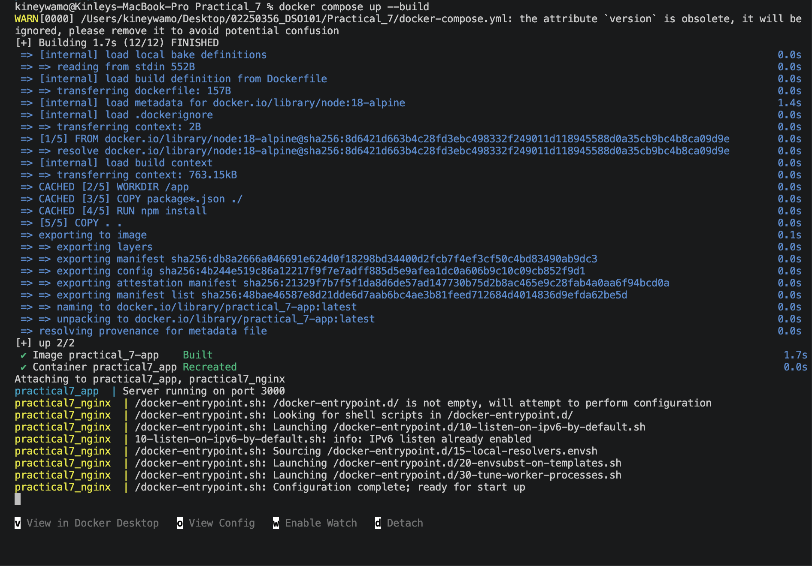
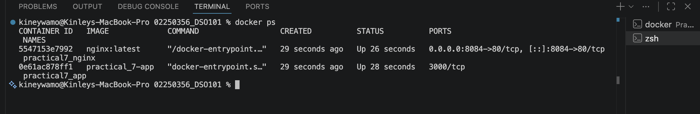
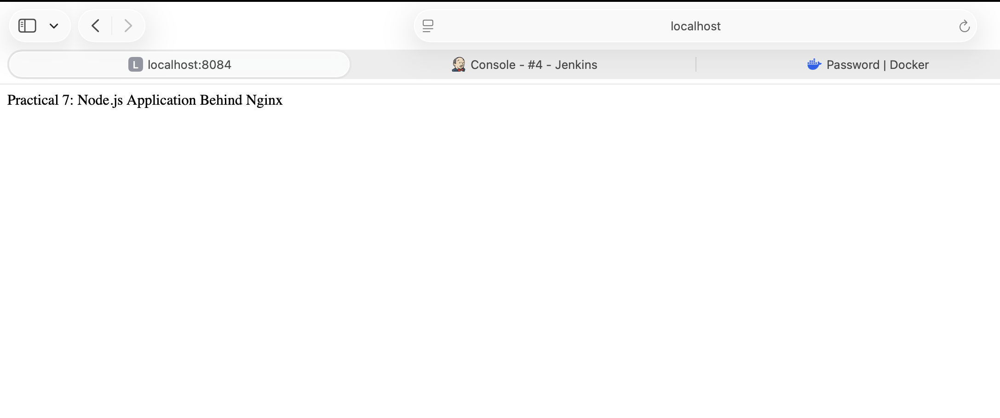

# Practical 7: Configure Nginx as a Reverse Proxy for a Dockerized Application

## Objective

The objective of this practical is to configure Nginx as a reverse proxy for a Dockerized Node.js application. Docker Compose is used to run both the Node.js application and the Nginx server, allowing requests from the client to be forwarded through Nginx to the backend application.

---

## Prerequisites

- Docker Desktop installed and running
- Docker Compose
- Visual Studio Code
- Basic knowledge of Docker and Nginx

---

## Project Structure

```text
Practical_7
│
├── app.js
├── package.json
├── Dockerfile
├── docker-compose.yml
└── nginx.conf
```

---

## Application Code

### app.js

```javascript
const express = require("express");

const app = express();

app.get("/", (req, res) => {
    res.send("Practical 7: Node.js Application Behind Nginx");
});

app.listen(3000, () => {
    console.log("Server running on port 3000");
});
```

---

### package.json

```json
{
  "name": "practical7",
  "version": "1.0.0",
  "main": "app.js",
  "dependencies": {
    "express": "^4.18.2"
  }
}
```

---

## Dockerfile

```dockerfile
FROM node:18-alpine

WORKDIR /app

COPY package*.json ./

RUN npm install

COPY . .

EXPOSE 3000

CMD ["node", "app.js"]
```

---

## Nginx Configuration

### nginx.conf

```nginx
events {}

http {

    server {

        listen 80;

        location / {

            proxy_pass http://app:3000;

            proxy_set_header Host $host;

            proxy_set_header X-Real-IP $remote_addr;

            proxy_set_header X-Forwarded-For $proxy_add_x_forwarded_for;

        }

    }

}
```

---

## Docker Compose Configuration

### docker-compose.yml

```yaml
version: "3"

services:

  app:

    build: .

    container_name: practical7_app

  nginx:

    image: nginx:latest

    container_name: practical7_nginx

    ports:
      - "8084:80"

    volumes:
      - ./nginx.conf:/etc/nginx/nginx.conf:ro

    depends_on:
      - app
```

---

## Steps Performed

1. Created a Node.js Express application.
2. Created a Dockerfile to containerize the application.
3. Configured Nginx as a reverse proxy.
4. Created a Docker Compose configuration to run both containers.
5. Built and started the containers using Docker Compose.
6. Verified communication between Nginx and the Node.js application.

---

## Commands Used

### Build and Start Containers

```bash
docker compose up --build
```



### View Running Containers

```bash
docker ps
```



### Stop Containers

```bash
docker compose down
```

---

## Testing

Open the browser and visit:

http://localhost:8084

Expected Output:

```
Practical 7: Node.js Application Behind Nginx
```



---

## Architecture

```text
Browser
    │
    ▼
localhost:8084
    │
    ▼
Nginx Reverse Proxy
    │
    ▼
Node.js Application (Port 3000)
```

---

## Outcome

The Node.js application was successfully containerized and served through Nginx acting as a reverse proxy. Docker Compose simplified the deployment and management of both services.

---

## Conclusion

Nginx can be effectively used as a reverse proxy to route client requests to backend applications running in Docker containers. Docker Compose enables easy orchestration of multiple services, making deployment more efficient and maintainable.