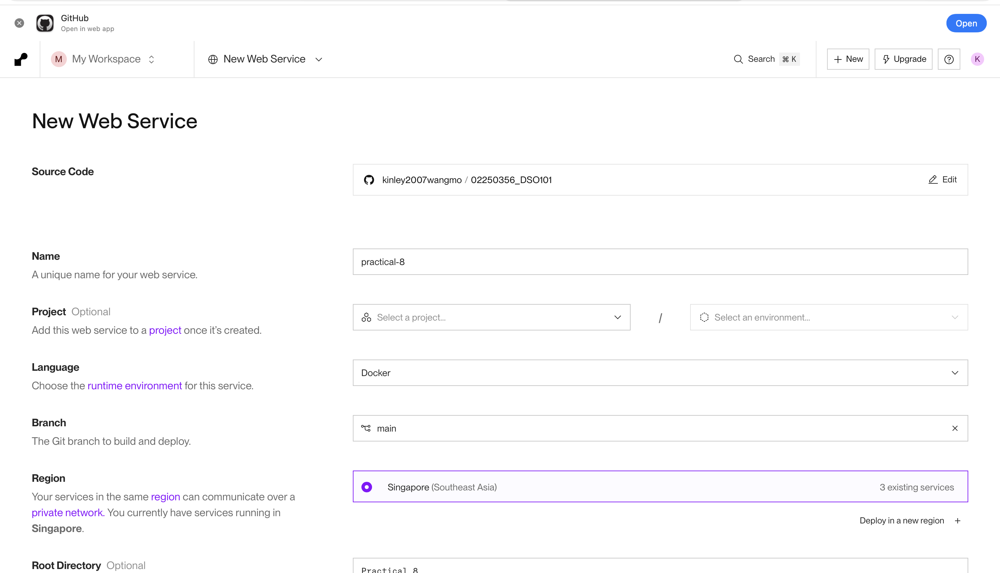
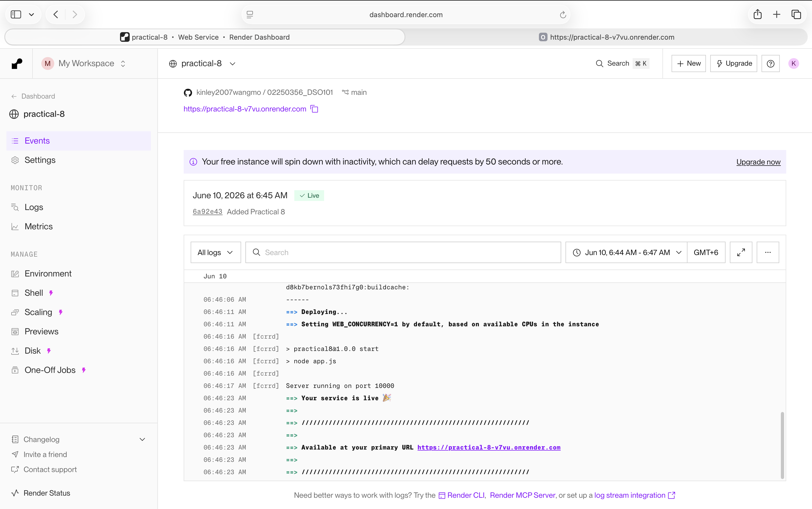
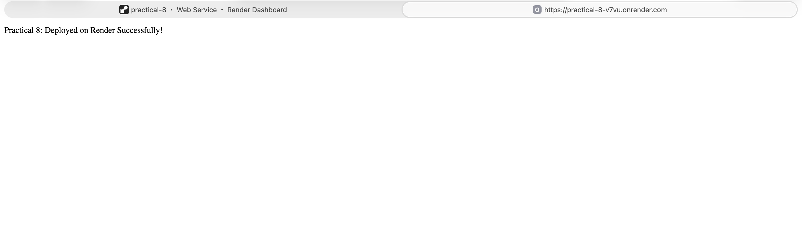
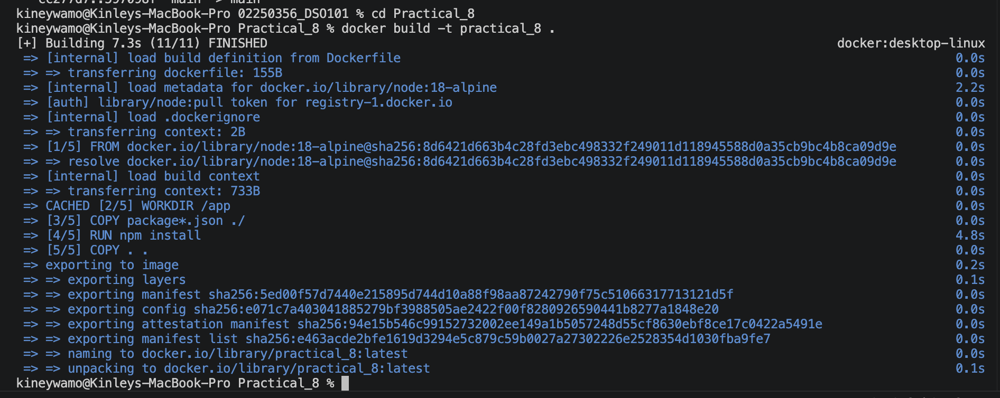
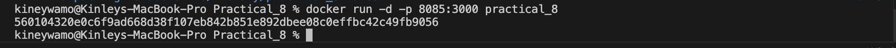
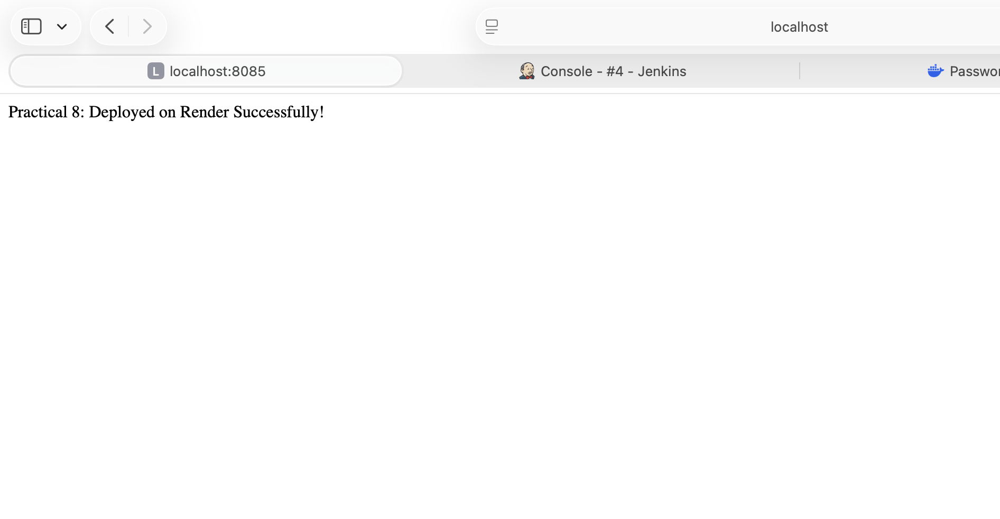

# Practical 8: Deploy a Containerized Web Application on a Cloud Platform

## Objective

The objective of this practical is to deploy a Dockerized Node.js application to a cloud platform using Render. The application is containerized with Docker and made publicly accessible through a live URL.

---

## Prerequisites

- Docker Desktop
- GitHub account
- Render account
- Visual Studio Code

---

## Project Structure

```text
Practical_8
│
├── app.js
├── package.json
├── Dockerfile
└── README.md
```

---

## app.js

```javascript
const express = require("express");

const app = express();

const PORT = process.env.PORT || 3000;

app.get("/", (req, res) => {
    res.send("Practical 8: Deployed on Render Successfully!");
});

app.listen(PORT, () => {
    console.log(`Server running on port ${PORT}`);
});
```

---

## package.json

```json
{
  "name": "practical8",
  "version": "1.0.0",
  "main": "app.js",
  "scripts": {
    "start": "node app.js"
  },
  "dependencies": {
    "express": "^4.18.2"
  }
}
```

---

## Dockerfile

```dockerfile
FROM node:18-alpine

WORKDIR /app

COPY package*.json ./

RUN npm install

COPY . .

EXPOSE 3000

CMD ["npm", "start"]
```

---

## Steps Performed

1. Created a Node.js Express application.
2. Containerized the application using Docker.
3. Tested the application locally.
4. Pushed the project to GitHub.
5. Connected the repository to Render.

6. Deployed the Dockerized application.

7. Verified successful deployment using the public URL.


---

## Local Testing

Build the image:

```bash
docker build -t practical_8 .
```



Run the container:

```bash
docker run -d -p 8085:3000 practical_8
```



Open:

http://localhost:8085



---

## Deployment Platform

- Platform: Render
- Runtime: Docker
- Branch: main
- Root Directory: Practical_8

---

## Outcome

The Dockerized application was successfully deployed to the cloud using Render and made accessible through a public URL.

---

## Conclusion

Cloud deployment enables applications to be accessed from anywhere over the internet. Using Docker with Render provides a simple and reliable way to deploy containerized applications.